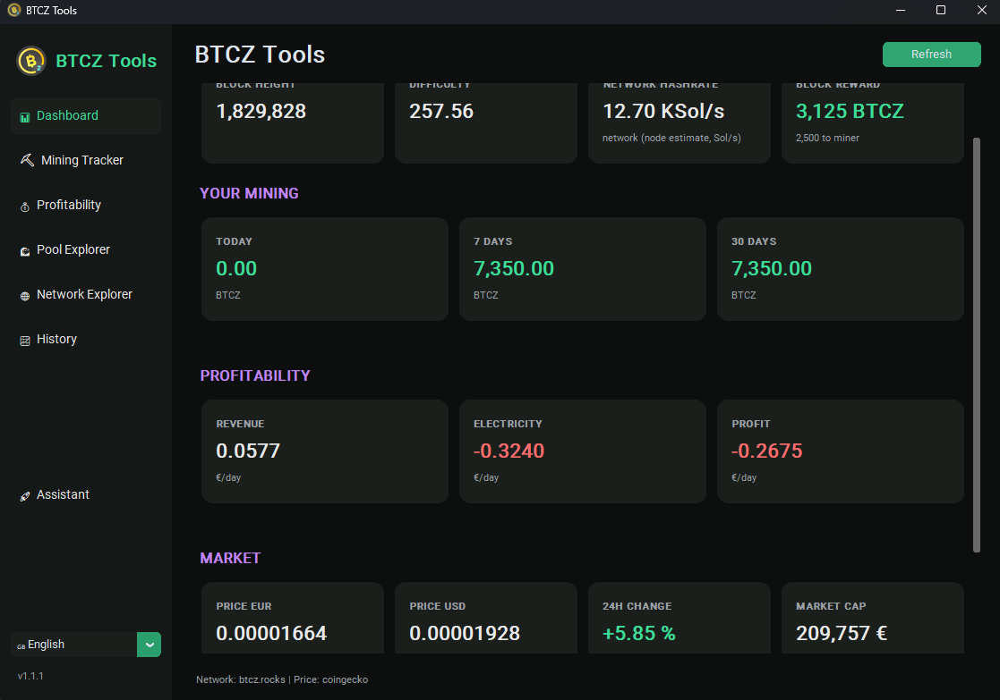
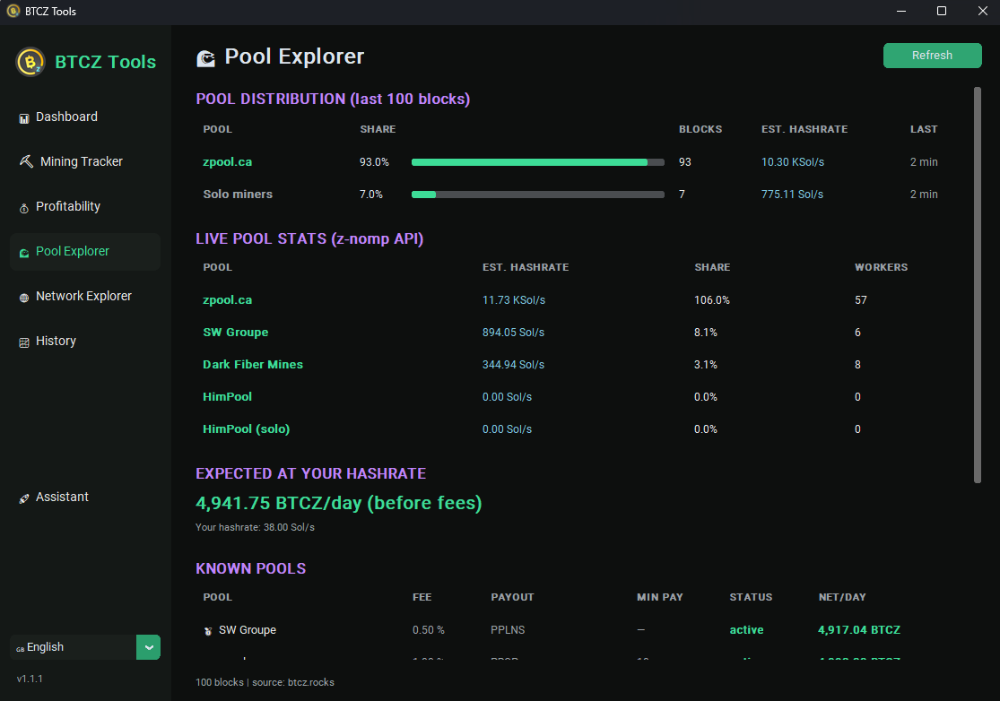
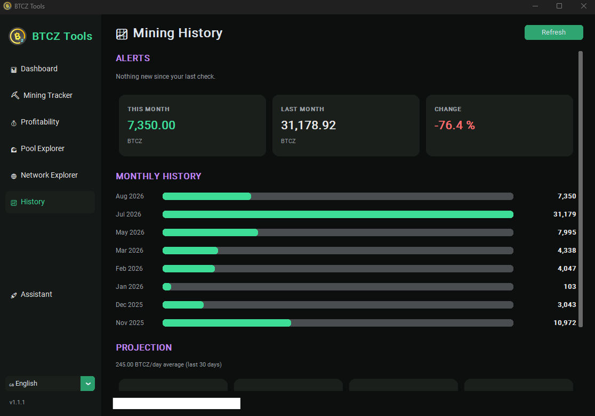
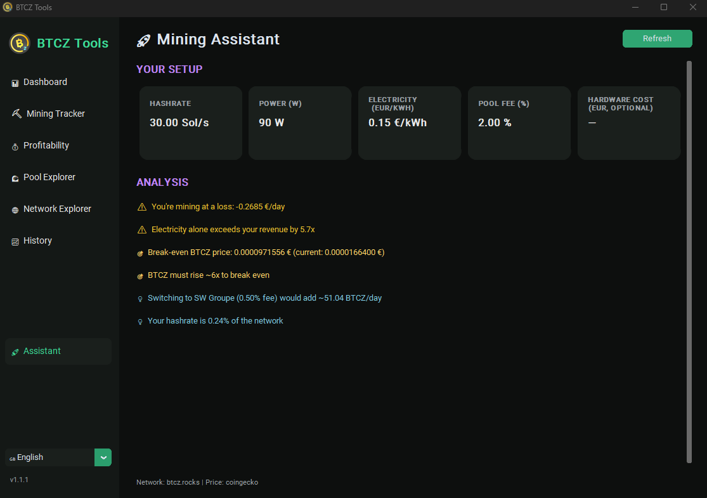

# BTCZ Tools

[](https://github.com/RGBTCZ/BTCZ-Tools/releases/latest)
[](https://github.com/RGBTCZ/BTCZ-Tools/releases)
[](./LICENSE)
[](https://www.python.org/)

A modular desktop toolkit for **BitcoinZ (BTCZ)** miners.
Built around a **shared data layer**: a piece of network data fetched once is reused everywhere.

## ⬇️ Download

### **[▶ Download BTCZ-Tools.exe](https://github.com/RGBTCZ/BTCZ-Tools/releases/latest)** — Windows, no install needed

Just download the latest `BTCZ-Tools.exe` and double-click. No Python, no setup.
Prefer running from source? See [Installation](#installation) below.

**Multilingual**: 🇬🇧 EN (default), 🇫🇷 FR, 🇪🇸 ES, 🇩🇪 DE — switch on the fly from the sidebar selector, language remembered in `data/settings.json`.
**BTCZ logo** downloaded on first launch and cached in `data/` (window icon + sidebar).
**Auto-update**: on launch the app checks GitHub for a newer release and, if one exists, offers to download the new `.exe` for you — silent when you're already up to date.

<p align="center">
  
</p>

## Modules

| Module | Status | Description |
|---|---|---|
| 📊 Dashboard | working | Home screen: network, your mining (today/7d/30d), profitability, market + quick access to every module |
| ⛏️ Mining Tracker | working | Rewards received on a t1 address (per day / date range, CSV export) + live pool-side stats (balance, paid, hashrate, workers) for any t1 address via z-nomp API |
| 💰 Profitability | working | Revenue, cost, profit, price scenarios, break-even and hardware ROI |
| 🌊 Pool Explorer | working | On-chain pool distribution (`minedBy`), live z-nomp pool stats, expected earnings for your hashrate, known-pools directory |
| 🌐 Network Explorer | working | Network stats + latest blocks (with miner) |
| 📈 History | working | Monthly mining history, this/last month comparison, projection (1/3/6/12 months), snapshot-based alerts (difficulty change, new rewards) |
| 🚀 Assistant | working | Rule-based analysis of your setup: monthly profit, break-even, electricity weight, best active pool to switch to, network share, hardware ROI |
| 🐳 Holder | working | Holder cockpit for one or more t1 addresses: total stack + live € value, sea-creature rank (🦐 Shrimp → 🐳 Whale) with progress to the next tier, moonshot price simulator, wealth milestones, share of circulating supply — plus a shareable PNG card (square + landscape, with an optional "hide amounts" mode) |
| ⏳ Halving | working | Live countdown to the next halving (days / hours / minutes / seconds), estimated date, era progress bar, and the block reward transition (current → after halving, with the miner share) — all computed on-chain from the block height |

## Screenshots

<table>
  <tr>
    <td align="center" width="50%"><a href="./screenshot-dashboard.png"></a><br><sub><b>📊 Dashboard</b></sub></td>
    <td align="center" width="50%"><a href="./screenshot-pool-explorer.png"></a><br><sub><b>🌊 Pool Explorer</b></sub></td>
  </tr>
  <tr>
    <td align="center" width="50%"><a href="./screenshot-history.png"></a><br><sub><b>📈 History</b></sub></td>
    <td align="center" width="50%"><a href="./screenshot-mining-assistant.png"></a><br><sub><b>🚀 Mining Assistant</b></sub></td>
  </tr>
</table>

## Architecture

```
BTCZTools/
├── app/
│   ├── main.py            entry point + navigation
│   ├── ui/                theme and reusable widgets
│   ├── core/              data layer, TTL cache, i18n, settings, logs, errors, updater
│   ├── api/               clients (insight, getbtcz, market)
│   ├── models/            shared models (NetworkStats, Block, ...)
│   └── utils/             formatting, mining calculations, assets
├── modules/               one folder per tool
├── config/                endpoints, TTLs, constants
└── data/                  local cache, history, logs, settings
```

## Data sources

- **Network / blocks / miner** — `explorer.btcz.rocks` (Insight, `getInfo` + `minedBy`)
- **Addresses** — `explorer.getbtcz.com` (primary) with `btcz.rocks` as fallback
- **Price & ATH** — CoinGecko (`bitcoinz`, EUR + USD; `/coins` for all-time high)
- **Circulating supply** — computed on-chain from the block height and the emission schedule (halving every 840 000 blocks), so it always matches the explorer without an extra request
- **Live pool stats** — each pool's own API: z-nomp (`/api/stats`) for SW Groupe & Dark Fiber Mines, zpool/yiimp (`/api/currencies`) for zpool.ca (hashrate, workers, network share)
- **Updates** — GitHub Releases API (`/releases/latest`) checked once at launch

The data layer automatically fails over to the backup source if the primary one is down.

## Network facts

- Block reward = `12500 / 2^(height // 840000)` → currently **3125 BTCZ** (miner share 2500)
- Target block time = 150 s
- BTCZ uses **Equihash 144,5 (Zhash)**: hashrate is in **Sol/s**, and the difficulty → hashrate conversion uses the `2^13` constant (not `2^32` like SHA-256 coins)
- Displayed network hashrate = node value (`networkhashps`, Sol/s), with `difficulty x 2^13 / blocktime` as fallback

## Requirements

- Python 3.10+
- Internet connection

## Installation

```bash
python -m venv venv
source venv/bin/activate      # Windows: venv\Scripts\activate
pip install -r requirements.txt
python run.py
```

Or simply run `./run_btcz.sh` — it creates the virtual environment, installs the dependencies on first launch, then starts the app.

## Roadmap

Phase 0 (architecture + data layer) ✅ → Phase 1 (Mining Tracker) ✅ → Phase 2 (Profitability) ✅ → Phase 3 (Pool Explorer + live pool APIs) ✅ → Phase 4 (Network Explorer) ✅ → Phase 5 (Dashboard) ✅ → Phase 6 (alerts + history) ✅ → Phase 7 (Mining Assistant) ✅

**The full roadmap is complete.** 🎉

Beyond the roadmap, BTCZ Tools keeps growing for the community: the **🐳 Holder** cockpit with its shareable card, the **⏳ Halving** countdown, and a **built-in auto-updater** that keeps everyone on the latest release.

## License

Released under the [MIT License](./LICENSE) © 2026 RGBTCZ.

Built for the BitcoinZ community.
