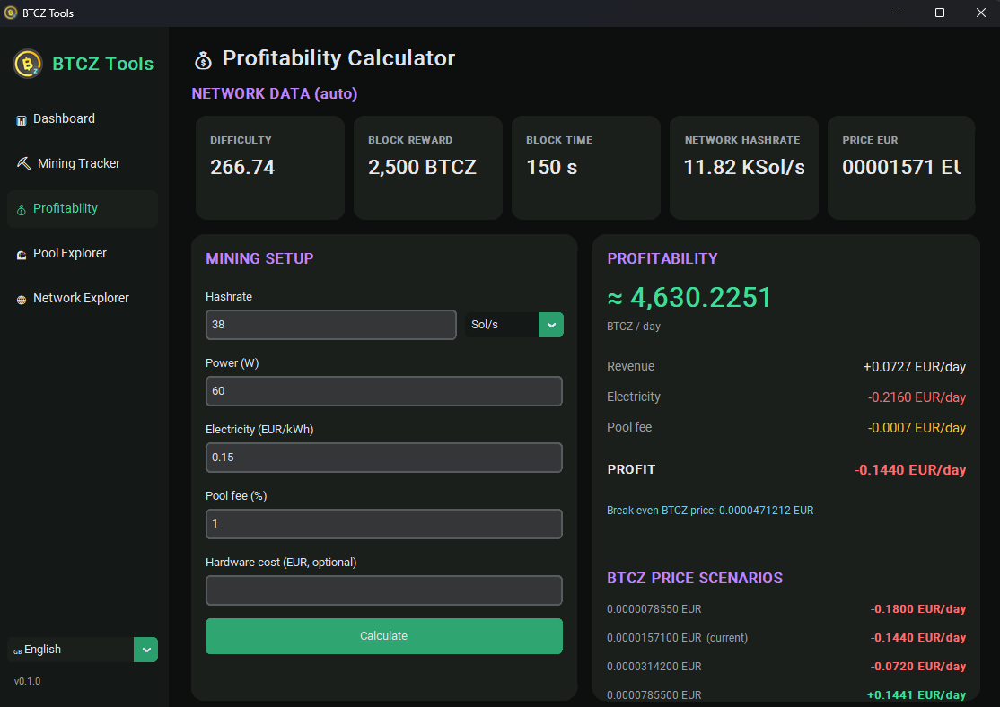

# BTCZ Tools

A modular desktop toolkit for **BitcoinZ (BTCZ)** miners.
Built around a **shared data layer**: a piece of network data fetched once is reused everywhere.

**Multilingual**: 🇬🇧 EN (default), 🇫🇷 FR, 🇪🇸 ES, 🇩🇪 DE — switch on the fly from the sidebar selector, language remembered in `data/settings.json`.
**BTCZ logo** downloaded on first launch and cached in `data/` (window icon + sidebar).



## Modules

| Module | Status | Description |
|---|---|---|
| 📊 Dashboard | working | Live network + market overview |
| ⛏️ Mining Tracker | working | Rewards received on a t1 address, per day or date range, CSV export |
| 💰 Profitability | working | Revenue, cost, profit, price scenarios, break-even and hardware ROI |
| 🌊 Pool Explorer | working | On-chain pool distribution (`minedBy`), live z-nomp pool stats, expected earnings for your hashrate, known-pools directory |
| 🌐 Network Explorer | working | Network stats + latest blocks (with miner) |

## Architecture

```
BTCZTools/
├── app/
│   ├── main.py            entry point + navigation
│   ├── ui/                theme and reusable widgets
│   ├── core/              data layer, TTL cache, i18n, settings, logs, errors
│   ├── api/               clients (insight, getbtcz, market)
│   ├── models/            shared models (NetworkStats, Block, ...)
│   └── utils/             formatting, mining calculations, assets
├── modules/               one folder per tool
├── config/                endpoints, TTLs, constants
└── data/                  local cache, history, logs, settings
```

## Data sources

- **Network / blocks / miner** — `explorer.btcz.rocks` (Insight, `getInfo` + `minedBy`)
- **Addresses** — `explorer.getbtcz.com` (primary) with `btcz.rocks` as fallback
- **Price** — CoinGecko (`bitcoinz`, EUR + USD)
- **Live pool stats** — each pool's own z-nomp API (`/api/stats`): hashrate, miners, workers, blocks (SW Groupe, Dark Fiber Mines)

The data layer automatically fails over to the backup source if the primary one is down.

## Network facts

- Block reward = `12500 / 2^(height // 840000)` → currently **3125 BTCZ** (miner share 2500)
- Target block time = 150 s
- BTCZ uses **Equihash 144,5 (Zhash)**: hashrate is in **Sol/s**, and the difficulty → hashrate conversion uses the `2^13` constant (not `2^32` like SHA-256 coins)
- Displayed network hashrate = node value (`networkhashps`, Sol/s), with `difficulty x 2^13 / blocktime` as fallback

## Requirements

- Python 3.10+
- Internet connection

## Installation

```bash
python -m venv venv
source venv/bin/activate      # Windows: venv\Scripts\activate
pip install -r requirements.txt
python run.py
```

Or simply run `./run_btcz.sh` — it creates the virtual environment, installs the dependencies on first launch, then starts the app.

## Roadmap

Phase 0 (architecture + data layer) → Phase 1 (Mining Tracker) → Phase 2 (Profitability) → **Phase 3 (Pool Explorer)** → Phase 4 (Network Explorer) → Phase 5 (Dashboard) → Phase 6 (alerts + history) → Phase 7 (Mining Assistant).

Built for the BitcoinZ community.
